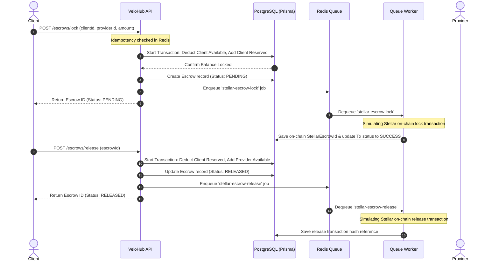

# VeloHub Architecture Overview

VeloHub is a payment orchestration monorepo designed to manage internal available/reserved balances in Web2 while routing on-chain escrows and deposits/withdrawals to non-custodial Stellar contracts and Airtm rails.

---

## 1. Core State & Balance Management

Users in the platform maintain two balance fields representing their ledger assets:
*   **Available Balance (`availableBalance`)**: Funds immediately available for withdrawal or locking into escrows.
*   **Reserved Balance (`reservedBalance`)**: Funds locked in active contract escrows awaiting client approval or dispute resolution.

### Balance State Transitions
*   **Top-up:** Available Balance +Amount
*   **Withdrawal:** Available Balance -Amount (Locked in PENDING, processed via Airtm)
*   **Lock Escrow:** Available Balance -Amount, Reserved Balance +Amount
*   **Release Escrow:** Client Reserved Balance -Amount, Provider Available Balance +Amount
*   **Refund Escrow:** Client Reserved Balance -Amount, Client Available Balance +Amount

---

## 2. System Architecture

The monorepo contains four decoupled layers coordinated via Redis queues and HTTP interfaces:

```
                      +-------------------+
                      |   Client SDK      |
                      +---------+---------+
                                | (HTTP / JSON)
                                v
                      +---------+---------+
                      |   API Server      |  <---+ Idempotency Cache (Redis)
                      |   (NestJS)        |
                      +---------+---------+
                                | (Push Queue Job)
                                v
+------------------+  +---------+---------+
|   PostgreSQL     | <+   Queue Worker    |
|   (Database)     |  |   (BullMQ)        |
+------------------+  +---------+---------+
                                |
                                +----> (Simulated APIs: Airtm / Stellar Contract)
```

---

## 3. Escrow Lifecycle (Sequence Diagram)

The diagram below details locking client funds inside the gateway database, matching it to the non-custodial Stellar escrow transaction, and releasing the funds to a provider:


